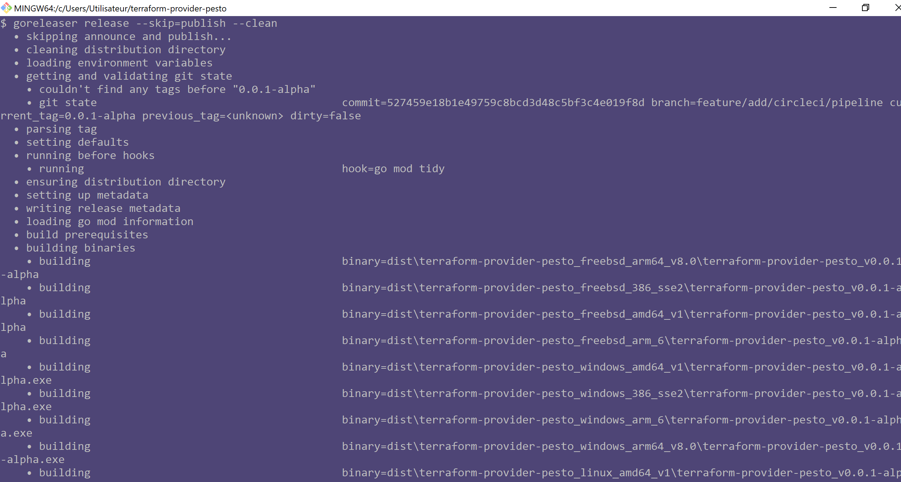

# The CI/CD

In this folder, you will find all design and concept informations about the CI/CD system at work for this project.

## Global Design

### About Golang-CI

#### Run it

```bash
golangci-lint run
```

Gave me, on 16th of November 2024, in git bash for windows, or in powershell, an stdout starting by:

```bash
$ golangci-lint run
level=warning msg="[lintersdb] The name \"vet\" is deprecated. The linter has been renamed to: govet."
level=warning msg="The linter 'exportloopref' is deprecated (since v1.60.2) due to: Since Go1.22 (loopvar) this linter is no longer relevant. Replaced by copyloopvar."

```

And here is the example stdout of the first time I ran the `golangci-lint run` command:


To solve th issues mentioned above, I changed the content of the `./.golang-ci.yml`, from:

```Yaml
# Visit https://golangci-lint.run/ for usage documentation
# and information on other useful linters
issues:
  max-per-linter: 0
  max-same-issues: 0

linters:
  disable-all: true
  enable:
    - durationcheck
    - errcheck
    - exportloopref
    - forcetypeassert
    - godot
    - gofmt
    - gosimple
    - ineffassign
    - makezero
    - misspell
    - nilerr
    - predeclared
    - staticcheck
    - tenv
    - unconvert
    - unparam
    - unused
    - vet
```

to:

```Yaml
# Visit https://golangci-lint.run/ for usage documentation
# and information on other useful linters
issues:
  max-per-linter: 0
  max-same-issues: 0

linters:
  disable-all: true
  enable:
    - durationcheck
    - errcheck
    # - exportloopref
    - copyloopvar
    - forcetypeassert
    - godot
    - gofmt
    - gosimple
    - ineffassign
    - makezero
    - misspell
    - nilerr
    - predeclared
    - staticcheck
    - tenv
    - unconvert
    - unparam
    - unused
    # - vet
    - govet
```

And I end up with a last new issue advertised by `golangci-lint`, about the go version I have installed on my computer:


By the time I ran into the above issues (the 16th of November 2024), the latest release version of GOlang was `1.23.3`:


At this point, I have two options, to solve this last issue:

* Either I upgrade my golang version (to `1.22`), and I can use `copyloopvar` linter.
* Or, I downgrade the installed version of `golangci-lint` to `v1.60.1` (the most latest released version before `v1.60.2`), and and I use the `exportloopref` linter instead of the `copyloopvar` linter.

Choosing between the two options is very important: I have designed the code of my terrraform provider with go version `1.21`, and I want, eventually, that my provider supports being built with both go version `1.21` **_and_** go version `1.22`.

This is why I will, on my computer, I chose:

* to edit the `./.golang-ci.yml` to use the `exportloopref` linter instead of the `copyloopvar` linter,
* and downgrade version of Golang CI Lint to version `v1.60.1`, and  by running:

```bash
export GOLANGCI_LINT_VERSION='v1.60.1'
./.ci/utils/installation/golangci-lint/windows/golangci-lint.sh

golangci-lint run

# Et voilà, no more warning
```

Et voilà, no more warning, only the 3 lint error messages are left, and I am not changing my  installed version of golang `go1.21`:


I then edited the 3 sources files to solve the clearly statedlint errors, and git commit and pushed.

Finally, when I will upgrade version of golang to `go1.22`, I will then:

* Upgrade `golangci-lint` to version `v1.62.0`
* edit the `./.golang-ci.yml` to use the `copyloopvar` linter instead of the `exportloopref` linter.

### About GoReleaser

* Install go releaser in a specific version, uisng git bash for Windows:

```bash
export GORELEASER_VERSION="v2.4.5"
chmod +x ./.ci/utils/installation/goreleaser/windows/goreleaser.sh
./.ci/utils/installation/goreleaser/windows/goreleaser.sh

```

Then you can run the build:

```bash

# ---
# build all executables for 
# all OS and CPUARCH as 
# configured in './.goreleaser.yml'
# - 
# 
goreleaser build --snapshot --single-target --clean

# ---
# build only for current GOOS GOARCH
goreleaser build --snapshot --single-target --clean 

# ---
# To install the executable in GOPATH/bin
goreleaser build --snapshot --single-target --clean --output "$(go env GOPATH)/bin/terraform-provider-pesto_v0.0.0-SNAPSHOT-57e8dfe.exe"

##### release dry run

# ---
# 
# to get my GPG Key fingerprint: [gpg --list-keys]
# 
# $env:GPG_FINGERPRINT = "1356 7525 DED4 F79A 0503  BBFB 7B19 A8E1 574C 2883"

export GPG_FINGERPRINT="4CC5E793F7519D9909CDFB3B5A45A04855E865D8"
goreleaser release --skip=publish --clean

```

**_Building a snapshot example output:_**


**_Runnning a release dry run example output:_**

* On first naive try, we immediately understand the git status needs to be clean (no files are modified or new, nothing to commit), and the git tag needs to be on the current commit:


* Then we understand the `GPG_FINGERPRINT` env. var. nees to be set to the GPG Key to use to sign the release files:


* Generate a TEst GPG Key to test the release dry run (I set an emptypass phrase for the test):


* And we finally have a success running the release dry run:




* And here is the extensive list of files generated by the release dry run:


## References

* <https://golangci-lint.run>
* <https://golangci-lint.run/welcome/install/>
* <https://golangci-lint.run/welcome/quick-start/>
* To "test everything before actually running a release", we can use _dry run_ commands, see <https://goreleaser.com/quick-start/#dry-run>

Very important, goreleaser has native support for monorepo pattern (and it can perhaps build n publish npm packages?):

* <https://goreleaser.com/customization/monorepo/>
* golang and npm packages:
  * <https://github.com/evg4b/goreleaser-npm-publisher>
  * <https://medium.com/xendit-engineering/how-we-repurposed-npm-to-publish-and-distribute-our-go-binaries-for-internal-cli-23981b80911b>

* Circle CI Orb for `goreleaser`: <https://circleci.com/developer/orbs/orb/hubci/goreleaser>

Some tutorials using `goreleaser`:

* <https://thekevinwang.com/2023/10/05/build-publish-terraform-provider>
